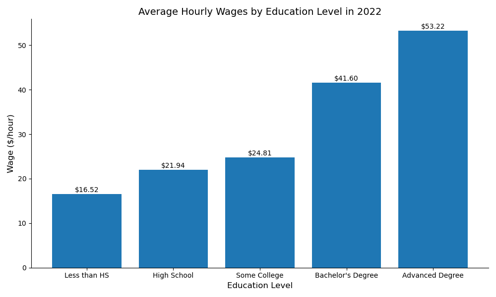
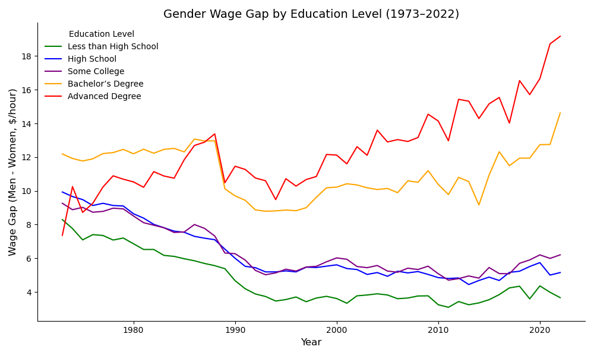
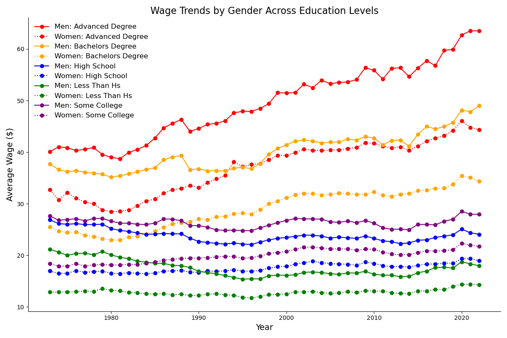

# The Impact of Different Education Levels on Wage Trends and Gender Disparities in the U.S. Labor Market (1973-2022)

**Market:** United States  
**Years:** 1973-2022  
**Unit:** Average real hourly wages (constant dollars)  
**Goal:** Examine how wage levels and gender gaps vary across education levels and over time.  
**Methods:** pandas, numpy, seaborn, matplotlib  

**Notebook:** [Open here](notebook/gender-wage-gap-by-education-us-1973-2022.ipynb)  
**Data source:** Public dataset [DOI: 10.34740/kaggle/ds/3836009](https://doi.org/10.34740/kaggle/ds/3836009)

### Results (TL;DR)
- Average real wages rise with education in every observed year.
- Gender gaps persist across education levels. The gap narrows in some windows but remains non-zero in 2022.

### Repo map
- `notebook/` — main analysis notebook  
- `data/wages_by_education.csv` — public CSV  
- `figures/` — exported PNGs

---

# Project Overview

This project examines how wages in the United States evolved across education levels and gender from 1973-2022. The goal is to load the public dataset, clean it, and analyze wage trends. The analysis helps explain how education relates to pay, how the gender wage gap changes over time, and what high level insights stakeholders should take away.

---

## Python Libraries Used
### pandas, numpy, seaborn, matplotlib

---

## Data and Exploration
### Public dataset

The data used in this project comes from a public Kaggle dataset:

1. https://www.kaggle.com/datasets/asaniczka/wages-by-education-in-the-usa-1973-2022  
   - Provenance: Economic Policy Institute State of Working America Data Library  
   - Market: United States  
   - Years: 1973-2022  
   - License: CC0 Public Domain  
   - DOI: 10.34740/kaggle/ds/3836009

---

### Exploration Questions

In my analysis I explore and answer the following questions:

1. How do average real hourly wages differ by education level in 2022? 
2. How large is the gender wage gap overall and within each education level, and how has it changed?
3. Which education levels show the steepest wage growth, and how have male and female trends diverged or converged within the same education?

---

## Question 1: How do average real hourly wages differ by education level in 2022?

To answer this question I focus on the year 2022 and compare average real hourly wages across education levels. 

**Question 1 Conclusion:** Average real hourly wages increase with higher education levels across the study period. See the notebook for details.

---

## Question 2: How large is the gender wage gap overall and within each education, and how has it changed?

I compare male and female pay over time and within each education level, then visualize how the gap changes across years.

**Question 2 Conclusion:** The gender gap persists within education levels. It narrows in some windows but remains present in 2022. See the notebook for specifics.

---

## Question 3: Which education levels show the steepest wage growth, and how have male and female trends diverged or converged within the same education?

I compare wage trends across education levels to see which levels rise the most over 1973-2022 and examine how male and female wages move within the same education level.

**Question 3 Conclusion:**  
- Over 1973-2022, growth increases with education level. Bachelor’s or higher shows the steepest long run rise, followed by Some college, then High school, with Less than high school growing the slowest.  
- Within selected education levels, female wages trend upward but remain below male wages. Some narrowing appears in later years.  
Details and any exact values are discussed in the notebook.

---

## Notebook

Open the analysis notebook here:

- [notebook/gender-wage-gap-by-education-us-1973-2022.ipynb](notebook/gender-wage-gap-by-education-us-1973-2022.ipynb)

---

## Files in this repo

- [data/wages_by_education.csv](data/wages_by_education.csv) — public CC0 dataset United States, 1973-2022  
- [figures/figure1_average_hourly_wages_educ_level.png](figures/figure1_average_hourly_wages_educ_level.png)  
- [figures/figure2_gender_wage_gap_over_time.png](figures/figure2_gender_wage_gap_over_time.png)  
- [figures/figure3_wage_trends_by_gender.png](figures/figure3_wage_trends_by_gender.png)
